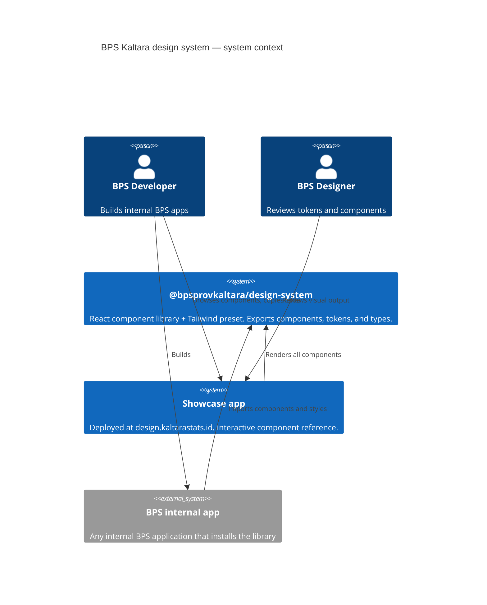
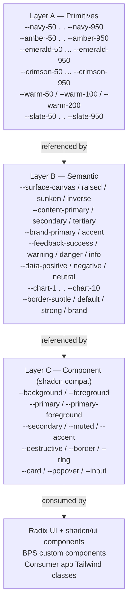
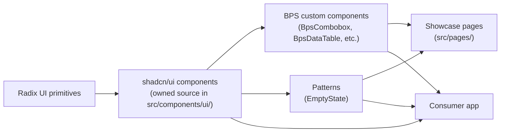

# Architecture

The BPS Kaltara design system operates in two modes from a single codebase: as a **component library** consumed by BPS internal apps, and as a **showcase app** deployed to `design.kaltarastats.id` for browsing and referencing components.

---

## System context

---

## Design token layer diagram

Tokens flow from raw primitive values to semantic roles to component-specific overrides. Consumers should reference Layer B (semantic) tokens in their own code and never Layer A (primitive) directly.

All token values are bare HSL components — no `hsl()` wrapper. Usage: `hsl(var(--token))`. Exception: `--warm-50`, `--warm-100`, `--warm-200` are pre-wrapped `hsl()` values and must be used as `var(--warm-*)` directly (see `docs/development.md` for details).

---

## Component dependency diagram

BPS custom components build on top of shadcn/ui primitives. They are not built on Radix UI directly. Patterns (`EmptyState`) use shadcn/ui `Button` and are self-contained.

---

## Key design decisions

### Why shadcn/ui (owned source)

shadcn/ui components are copied into `src/components/ui/` at install time — they are not a runtime dependency. This means the team owns and can freely modify every component without forking a library or waiting for upstream changes. The trade-off is that upstream shadcn/ui improvements must be manually pulled in.

See `docs/decisions/0001-record-architecture-decisions.md` for how future decisions should be recorded.

### Why a three-layer token system

Separating primitive scales (Layer A) from semantic roles (Layer B) from component aliases (Layer C) allows:
- Theming: swap Layer B values for a different visual theme without touching components.
- shadcn/ui compatibility: Layer C maps semantic tokens onto the `--primary`, `--background` names that shadcn components expect, so all components work without modification.
- Consistency: developers reference semantic tokens (`--content-primary`) rather than raw palette values (`--navy-900`), making intent explicit.

### Why Vite lib build

`vite.lib.config.ts` produces dual ESM (`dist/index.js`) and CJS (`dist/index.cjs`) outputs from a single build. `vite-plugin-dts` generates `dist/index.d.ts`. This covers both modern bundlers (ESM) and older toolchains (CJS require) without a separate Rollup configuration.

### Tailwind preset export pattern

The library exports a Tailwind preset at `@bpsprovkaltara/design-system/tailwind-preset`. Consumer apps add this as a `presets` entry in their `tailwind.config.ts`. This ensures all design tokens, custom scales, keyframes (`animate-shimmer`), and font families are available in the consumer without copy-pasting configuration.

---

## Build modes

| Mode | Command | Entry | Output |
|---|---|---|---|
| Showcase app | `pnpm dev` / `pnpm build` | `src/main.tsx` | `dist/` (SPA) |
| Library | `pnpm build:lib` | `src/index.ts` + `src/tailwind-preset.ts` | `dist/index.js`, `dist/index.cjs`, `dist/styles.css`, etc. |

Both modes use the same source. The library build excludes React from the bundle (external peer dependency). The showcase build bundles everything.
